# KicksVibe

<div align="center">
  <!--  -->
  <h3>A modern Flutter storefront for discovering and buying sneakers</h3>
  <p>
    KicksVibe combines a polished shopping experience with Firebase services,
    local caching, location-aware checkout, and secure payment processing.
  </p>

  <p>
    
    
    
    
    
  </p>
</div>

## Overview

KicksVibe is a feature-rich e-commerce application focused on footwear. It is
designed around a clean, feature-first architecture and provides the complete
journey from account creation and product discovery to cart management,
location-aware checkout, payment, and order history.

## Features

- **Authentication:** Email/password authentication, email verification, and Google Sign-In.
- **Product discovery:** Search, best sellers, product details, image galleries, and multi-criteria filters.
- **Shopping flow:** Favorites, cart calculations, shipping fees, checkout, and order history.
- **Payments:** Paymob integration for card and supported local payment methods.
- **Location services:** Current location, reverse geocoding, and OpenStreetMap display.
- **Localization:** English, Arabic, and French support.
- **Personalization:** Light and dark themes with profile settings.
- **Performance:** Shimmer loading states, cached network images, Hive persistence, and SharedPreferences.
- **Notifications:** Firebase Cloud Messaging integration.

## App Preview

<div align="center">
  <table>
    <tr>
      <td align="center">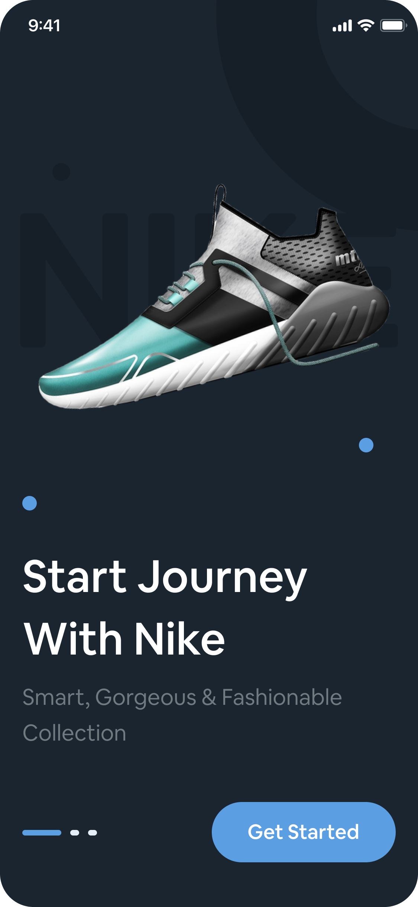<br /></td>
      <td align="center">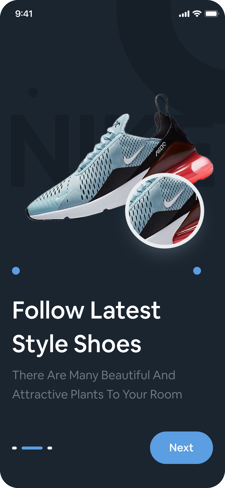</td>
      <td align="center">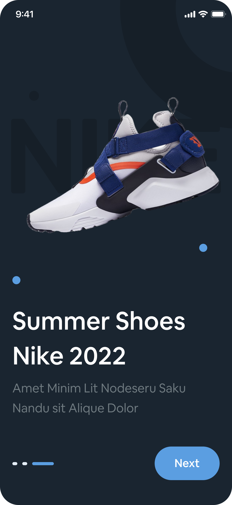</td>
    </tr>
    <tr>
      <td align="center">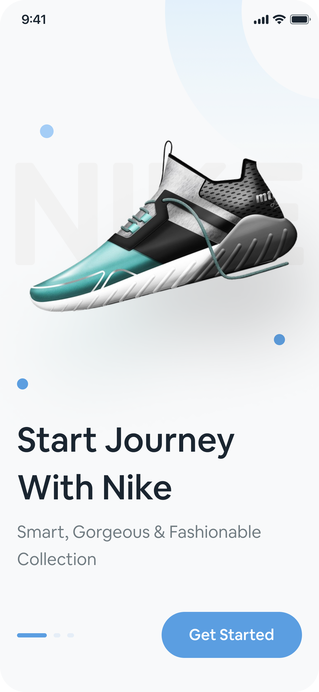</td>
      <td align="center">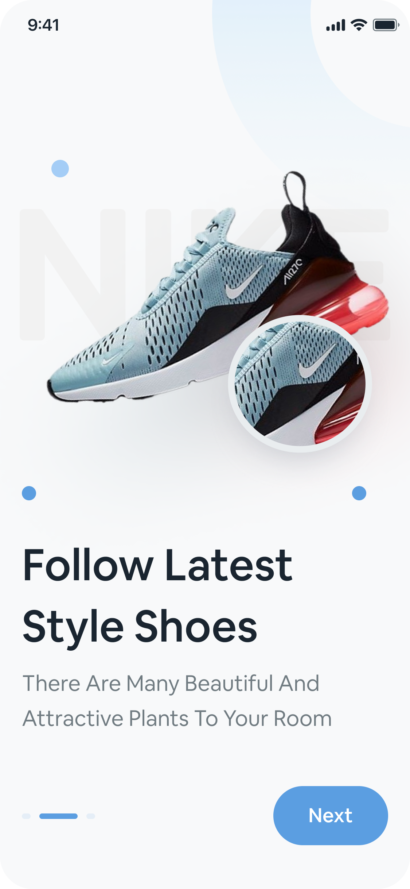</td>
      <td align="center">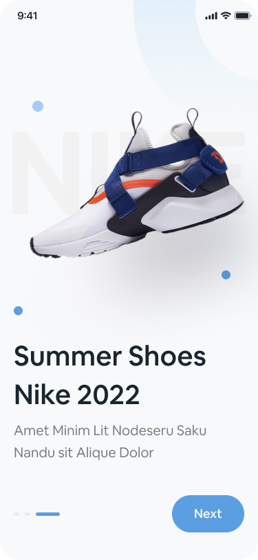</td>
    </tr>
  </table>
</div>
</br>
</br>

<div align="center">
  <table>
    <tr>
      <td align="center"><br /><strong>Home</strong></td>
      <td align="center"><br /><strong>Search</strong></td>
      <td align="center">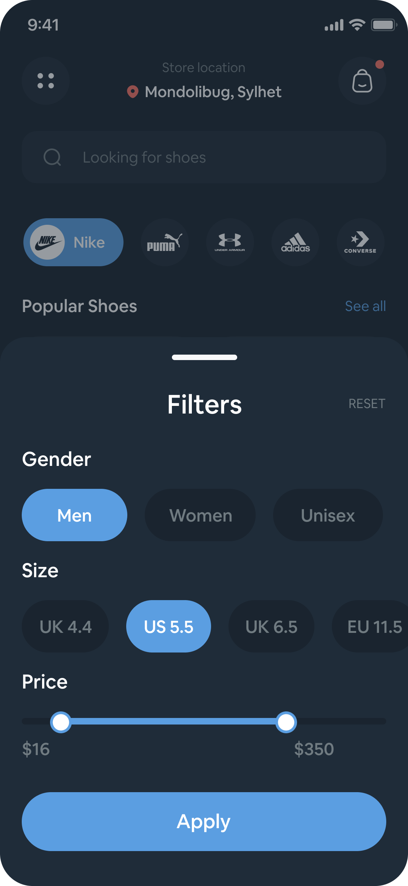<br /><strong>Filters</strong></td>
      <td align="center"><br /><strong>Best Sellers</strong></td>
    </tr>
    <tr>
      <td align="center"><br /><strong>Product Details</strong></td>
      <td align="center"><br /><strong>Cart</strong></td>
      <td align="center"><br /><strong>Checkout</strong></td>
      <td align="center">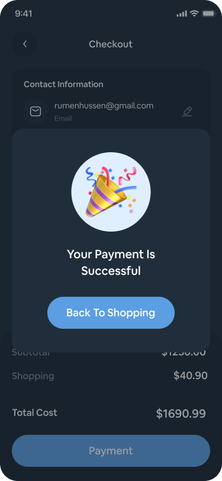<br /><strong>Checkout</strong></td>
      <td align="center"><br /><strong>Profile</strong></td>
    </tr>
  </table>
</div>

## Light Version

<div align="center">
  <table>
    <tr>
      <td align="center">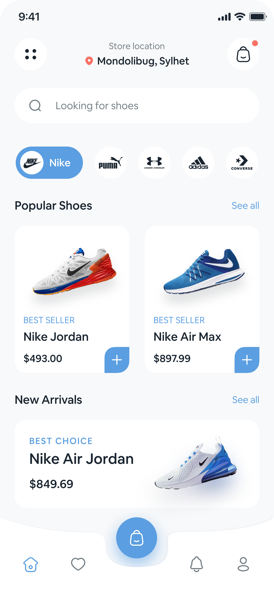<br /><strong>Home</strong></td>
      <td align="center">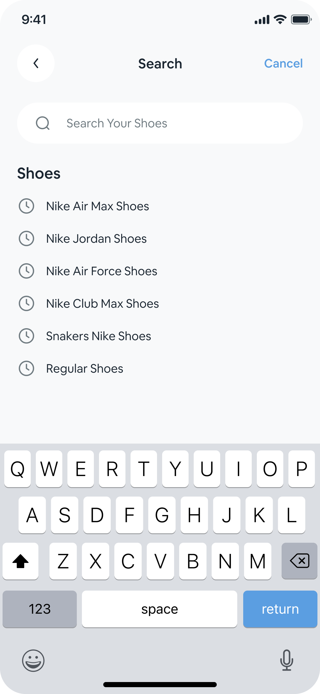<br /><strong>Filter</strong></td>
      <td align="center">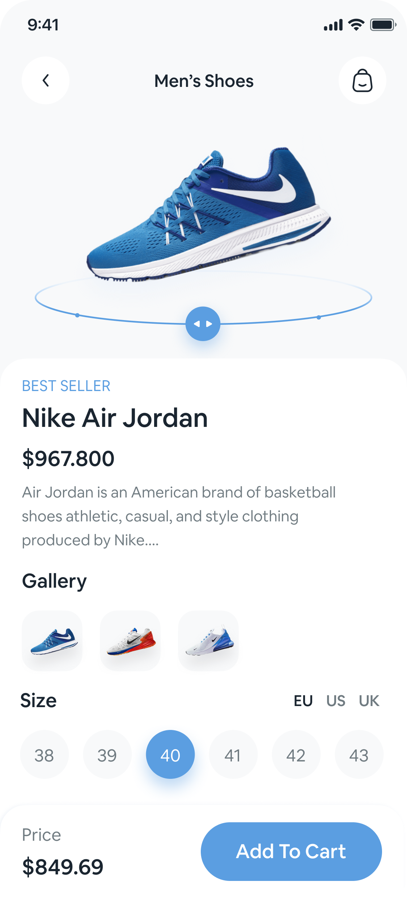<br /><strong>Product Details</strong></td>
      <td align="center">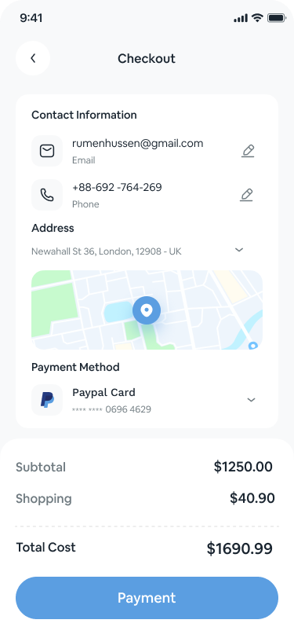<br /><strong>Checkout Details</strong></td>
      <td align="center">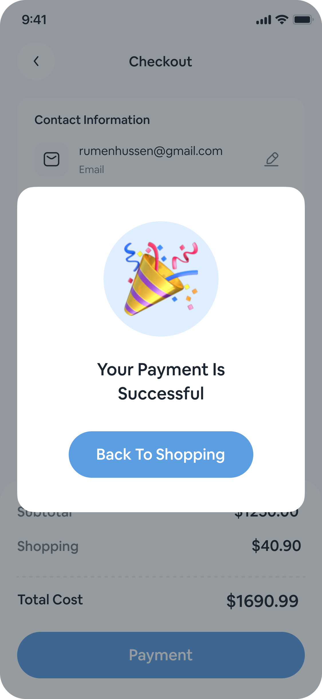<br /><strong>Checkout</strong></td>
    </tr>
  </table>
  <p><strong>Light version of the application</strong><br /></p>
</div>

## Technology Stack

| Area                 | Technology                                                    |
| -------------------- | ------------------------------------------------------------- |
| Framework            | Flutter and Dart                                              |
| State management     | BLoC / Cubit with `flutter_bloc`                              |
| Architecture         | Clean Architecture with feature-based modules                 |
| Dependency injection | `get_it` and `injectable`                                     |
| Backend              | Firebase Authentication, Cloud Firestore, and Cloud Messaging |
| Local storage        | Hive CE and SharedPreferences                                 |
| Networking           | Dio                                                           |
| Maps and location    | `flutter_map`, `geolocator`, `geocoding`, and OpenStreetMap   |
| Payments             | Paymob through secure API calls and WebView checkout          |

## Architecture

Each feature module follows Clean Architecture with three layers:

- **Data:** Remote/local data sources, models, and repository implementations.
- **Domain:** Entities, repository interfaces, and use cases (business logic).
- **Presentation:** BLoC/Cubit state management, screens, and widgets.

This separation keeps business logic independent from UI and data sources, making features easier to test, maintain, and extend.

## Project Structure

```text
lib/
├── core/                 # Shared utilities, routing, localization, and DI
├── features/             # Feature-first application modules
│   ├── auth/             # Sign in, sign up, and password recovery
│   ├── home/             # Home feed, brands, and loading states
│   ├── search/           # Search and filter workflows
│   ├── product_details/  # Product gallery and product actions
│   ├── cart/             # Cart state and calculations
│   ├── checkout/         # Location, maps, and payment flow
│   ├── orders/           # Order history and tracking
│   └── profile/          # Account settings, language, and theme
├── firebase_options.dart # Generated Firebase platform configuration
├── hive_registrar.g.dart # Generated Hive adapters
└── main.dart             # Application entry point
```

## Getting Started

### Prerequisites

- Flutter SDK compatible with Dart `3.12.2` or newer.
- A configured Firebase project for Android, iOS, or another target platform.
- Paymob credentials for testing the payment flow.

### Installation

1. Install the project dependencies:

   ```bash
   flutter pub get
   ```

2. Configure Firebase for the platform you want to run. The repository already
   contains generated Firebase configuration files; replace them with your
   project configuration when using a different Firebase project.

3. Add the required environment and payment settings to `env.json` at the
   project root. Keep private credentials out of source control. Example:

   ```json
   {
     "PAYMOB_API_KEY": "your_paymob_api_key",
     "PAYMOB_INTEGRATION_ID": "your_integration_id",
     "PAYMOB_IFRAME_ID": "your_iframe_id",
     "PAYMOB_HMAC_SECRET": "your_hmac_secret"
   }
   ```

4. Run the application on a connected device or emulator:

   ```bash
   flutter run
   ```

### Useful Commands

```bash
# Check the project for analyzer issues
flutter analyze

# Run the test suite
flutter test

# Regenerate injectable and Hive generated files when needed
dart run build_runner build --delete-conflicting-outputs
```

## Configuration Notes

- Firebase Authentication, Firestore, and Cloud Messaging must be enabled in the Firebase console.
- Location permissions must be granted by the user before requesting the current location.
- Payment credentials are environment-specific and should never be hard-coded or committed.
- Android and iOS platform permissions must be configured before testing maps, location, notifications, or payments.

## License

This project is not currently published under an open-source license. All rights reserved.

## Author

**Abdulrhman**
Flutter & Android Native (Kotlin) Developer